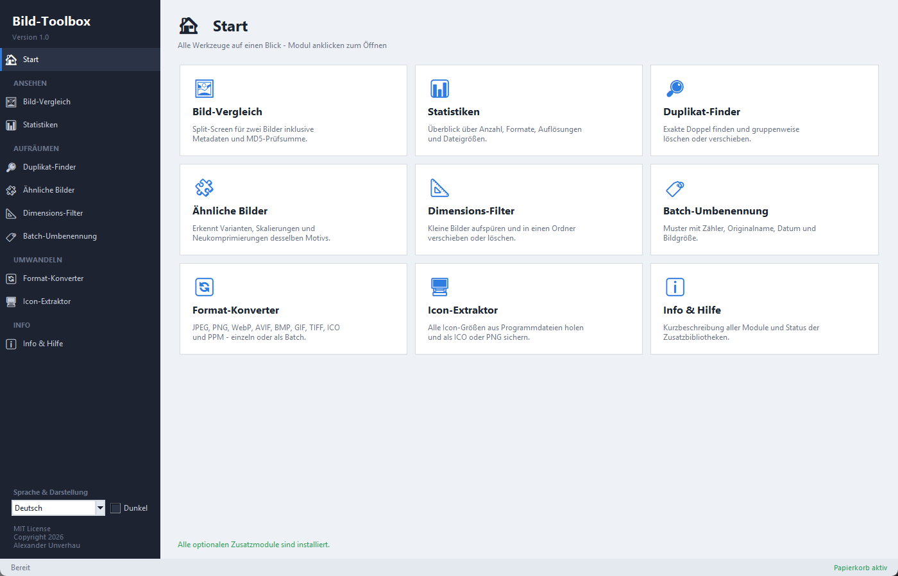
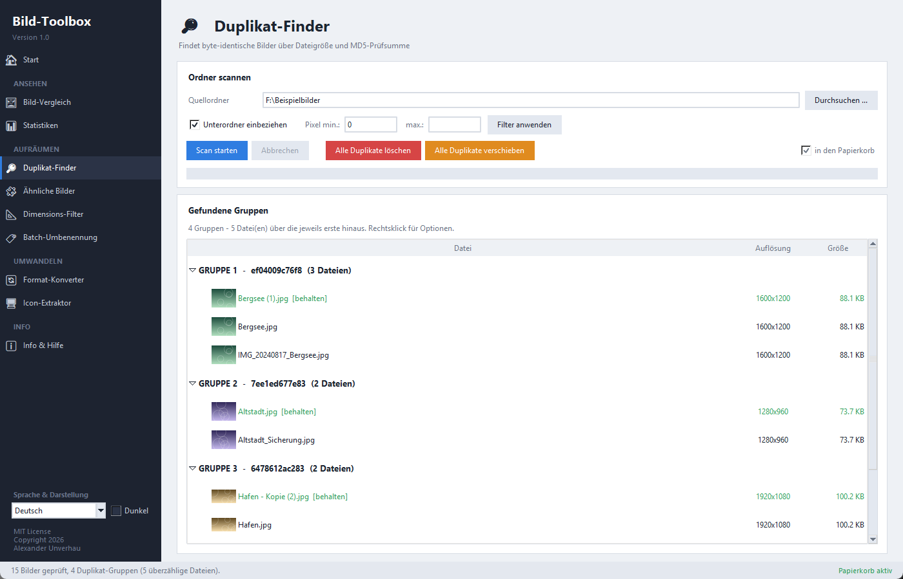
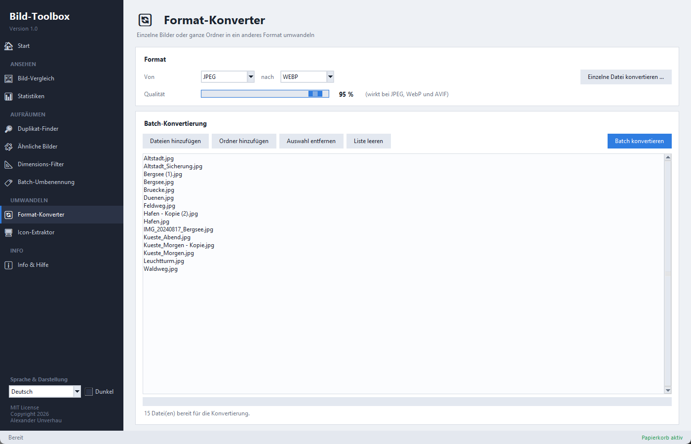
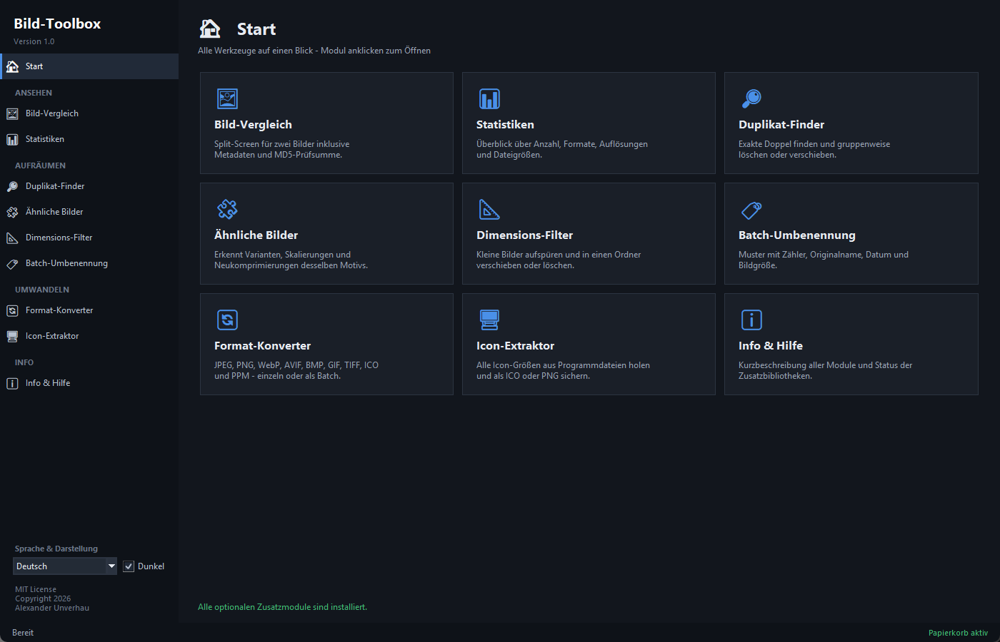

# Bild-Toolbox

**Every image tool in one application** – a desktop app for Windows, macOS and Linux that
combines image comparison, duplicate detection, format conversion, icon extraction and more
under a single interface. One Python file, no installer, no cloud, no telemetry – everything
runs locally.

[](https://github.com/DerAlexmann/bild-toolbox/actions/workflows/ci.yml)
[](LICENSE)
[](https://www.python.org/downloads/)

*German version: **[README.md](README.md)***

The user interface ships in **German and English** and picks your system language on first
start; you can switch it at any time in the sidebar.

---

## Screenshots



<details>
<summary><b>More views</b> – duplicate finder, format converter, dark theme</summary>

### Duplicate finder

Byte-identical images are grouped by file size and MD5 checksum. The first file
in each group is marked *[behalten]* (keep); everything beyond it can be deleted
or moved per group.



### Format converter



### Dark theme

Switchable at runtime, bottom left in the sidebar.



</details>

> The screenshots show the German interface; the app ships in English too.

---

## Modules

| Module | What it does |
|---|---|
| 🖼 **Image comparison** | Inspect two images side by side – including metadata and MD5 checksum. Open, swap, delete. |
| 🔎 **Duplicate finder** | Find byte-identical images via file size and MD5, then delete or move them per group. |
| 🧩 **Similar images** | Detect visually similar images with a perceptual hash – variants, rescales, re-encodes. |
| 📐 **Dimension filter** | Track down images below a threshold in **both** width and height and sort them out. |
| 🏷 **Batch rename** | Rename whole folders by pattern – counter, original name, date and image size. |
| 📊 **Statistics** | Break down formats, resolutions and file sizes of a folder. |
| 🔄 **Format converter** | JPEG, PNG, WebP, AVIF, BMP, GIF, TIFF, ICO and PPM – single files or batches. |
| 🖥 **Icon extractor** | Pull every icon size out of EXE, DLL and image files and save it as ICO or PNG. |
| ℹ **Info & help** | Short description of every module and the status of the optional libraries. |

**Other features**

- Light and dark colour scheme, switchable at runtime
- Bilingual interface (German / English)
- Keyboard: `Ctrl+1` … `Ctrl+9` jump straight to a module, `Esc` returns to the home screen
- Optional recycle-bin deletion (via `send2trash`) instead of permanent removal
- Supported formats: JPG, JPEG, PNG, BMP, GIF, WebP, AVIF, TIF, TIFF, ICO, JFIF, HEIC, HEIF, PPM

---

## Installation

### Requirements

- **Python 3.9 or newer** ([python.org](https://www.python.org/downloads/)) – on Windows, tick
  *"Add Python to PATH"* during installation
- **Tkinter** – already included in the official Windows and macOS installers.
  On Debian/Ubuntu: `sudo apt install python3-tk`

### Quick start

```bash
git clone https://github.com/DerAlexmann/bild-toolbox.git
cd bild-toolbox
pip install -r requirements.txt
```

Then run it:

- **Windows:** double-click `Bild-Toolbox.pyw` (the `.pyw` extension starts the app without a
  console window)
- **macOS / Linux:** `python Bild-Toolbox.pyw`

### Optional extras

The toolbox runs without these packages – individual features are simply unavailable.
The *Info & help* tab always shows what is installed.

```bash
pip install -r requirements-optional.txt
```

| Package | Purpose | Without it |
|---|---|---|
| `Pillow` | Read, write and scale images | **Required** – the app will not start |
| `send2trash` | Delete to the recycle bin instead of permanently | Files are deleted permanently |
| `icoextract` | Read icons from EXE and DLL files | The icon extractor handles image files only |
| `pillow-heif` | Open HEIC and HEIF files | Those formats are skipped |

---

## Using it

1. Start the app – the home screen shows every module as a tile.
2. Click a module, pick a folder or file, start the scan or conversion.
3. Results appear as a list with thumbnails (at most 300 previews per result list, to keep the
   interface responsive).
4. Actions such as *delete* or *move* only ever affect the selected entries and always ask first.

> [!TIP]
> Enable recycle-bin mode (`send2trash`) while you get familiar with the clean-up modules.
> Anything removed can then be restored.

---

## Settings and generated files

The app writes two files next to the script:

| File | Contents |
|---|---|
| `bild-toolbox.json` | Selected language and colour scheme |
| `bild-toolbox_fehler.log` | Created **only** when an actual error occurs |

If that folder is not writable, both files fall back to the user's home directory. In an
executable built with PyInstaller they sit next to the EXE, so that language and colour scheme
survive a restart. Both files are listed in `.gitignore`.

---

## Platform notes

The toolbox is written to be cross-platform but is most complete on **Windows**:

- The **icon extractor** reads icons from `.exe`, `.dll`, `.sys`, `.mun`, `.ocx`, `.cpl` and
  `.scr`, which only makes sense on Windows. Image files work everywhere.
- The interface uses the *Segoe UI* and *Consolas* fonts. Tk substitutes them automatically on
  macOS and Linux, so the layout may shift slightly.
- *Show in file manager* and *open with default application* use `explorer`, `open` or
  `xdg-open` depending on the system.

---

## Adding a language

The source language is German: the German string in the code is also the translation key.
Adding a language takes two steps (at the very bottom of `Bild-Toolbox.pyw`):

1. Add the code and display name to `LANGUAGE_NAMES`, e.g. `"fr": "Français"`.
2. Add a `"fr": { ... }` entry to `TRANSLATIONS` and translate the lines you want.

Untranslated lines fall back to German automatically, so an incomplete table is fine.
Placeholders in curly braces (`{count}`, `{path}`, `{error}` …) must appear unchanged in the
translation; their order within the sentence is free. The test suite checks this automatically.

## Adding a colour scheme

Add another palette to `THEMES` using the **same** key names. `apply_theme()` writes the values
into the module variables; the rest of the code needs to know nothing about the switch.

---

## Development

```bash
pip install -r requirements.txt -r requirements-dev.txt
ruff check .            # linting
python -m pytest        # tests (translations, themes, module registry)
```

The tests are deliberately GUI-free: they import `Bild-Toolbox.pyw` as a module and check the
data structures without opening a window.

---

## Contributing

Bug reports, translations and suggestions are welcome. See [CONTRIBUTING.md](CONTRIBUTING.md)
and the [Code of Conduct](CODE_OF_CONDUCT.md). Please report security issues as described in
[SECURITY.md](SECURITY.md).

## Changelog

Every release is documented in [CHANGELOG.md](CHANGELOG.md).

---

## License and authorship

[MIT](LICENSE) · Copyright © 2026 Alexander Unverhau
· **Created with assistance of Claude AI (Anthropic)**

Bild-Toolbox was built in collaboration with Claude AI. For transparency, that note appears
everywhere the copyright notice does – in the header of `Bild-Toolbox.pyw`, in the app's
*Info & help* tab, in this document and in [NOTICE](NOTICE). It does not change the MIT
License in any way.

The program consolidates the earlier standalone programs *Bildbetrachter Pro 2.0*,
*Icon Extraktor*, *Universal Image Converter* and *Bild-Dimensions-Filter* into one interface.
